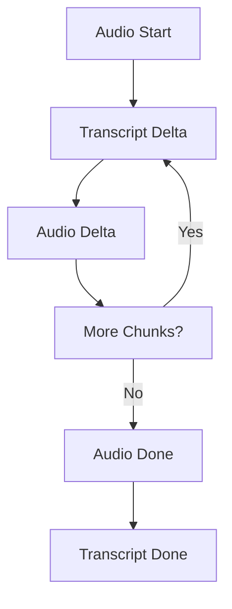

# Protocol Sequence Documentation
## OpenAI Real-time Chat with Audio Support

### 1. Connection Establishment
```sequence
Client -> OpenAI: WebSocket Connection Request
Note right of Client: Headers: Authorization, OpenAI-Beta
OpenAI -> Client: WebSocket Connection Accepted
```

### 2. Session Initialization
```json
// Client -> Server
{
  "type": "session.update",
  "session": {
    "modalities": ["text", "audio"],
    "voice": "alloy",
    "inputAudioFormat": "pcm16",
    "outputAudioFormat": "pcm16",
    "instructions": "..."
  }
}

// Server -> Client
{
  "type": "session.created",
  "session": {
    "id": "sess_xxx",
    "model": "gpt-4o-realtime-preview-2024-10-01",
    // ... configuration details
  }
}
```

### 3. Message Flow Sequence

#### 3.1 Text Message Sequence
```sequence
Client -> Server: conversation.item.create
Client -> Server: response.create
Server -> Client: response.content_part.added
Server -> Client: response.audio_transcript.delta
Server -> Client: response.audio.delta
Server -> Client: response.done
```

#### 3.2 Message Types and Timing
```plaintext
T+0.000: Client sends conversation item
T+0.001: Client sends response request
T+0.100: Server acknowledges (session.created)
T+0.200: Server starts sending content
T+0.300: Server sends audio chunks
T+1.000: Server completes response
```

### 4. Audio Processing Sequence

#### 4.1 Audio Response Flow


#### 4.2 Audio Chunk Format
```json
{
  "type": "response.audio.delta",
  "delta": "[base64-encoded-audio-data]",
  "response_id": "resp_xxx",
  "item_id": "item_xxx"
}
```

### 5. Response Types

#### 5.1 Text Response
```json
{
  "type": "response.done",
  "response": {
    "output": [{
      "content": [{
        "type": "text",
        "text": "Response content"
      }]
    }]
  }
}
```

#### 5.2 Audio Response
```json
{
  "type": "response.audio.done",
  "transcript": "Spoken text content",
  "response_id": "resp_xxx",
  "item_id": "item_xxx"
}
```

### 6. Error Handling Protocols

#### 6.1 Connection Errors
```sequence
Client -> Server: Ping (every 30s)
Server -> Client: Pong
Note right of Client: Connection alive
```

#### 6.2 Error Response Format
```json
{
  "type": "error",
  "error": {
    "code": "error_code",
    "message": "Error description"
  }
}
```

### 7. Shutdown Sequence
```sequence
Client -> Server: CloseMessage
Client -> Server: WebSocket Close
Server -> Client: Close Acknowledgment
Note right of Client: Cleanup Resources
```

### 8. Rate Limits and Updates
```json
{
  "type": "rate_limits.updated",
  "rate_limits": [{
    "name": "requests",
    "limit": 10000,
    "remaining": 9999
  }]
}
```

### 9. Integration Guidelines

#### 9.1 Session Management
1. Always initialize session with required modalities
2. Handle session updates appropriately
3. Maintain session state

#### 9.2 Audio Handling
1. Buffer audio chunks until complete
2. Process audio in correct sequence
3. Handle transcript synchronization

#### 9.3 Error Recovery
1. Implement exponential backoff
2. Handle connection drops
3. Maintain message integrity

### 10. Best Practices

#### 10.1 Connection Management
- Maintain ping/pong cycle
- Handle reconnection gracefully
- Monitor connection health

#### 10.2 Resource Management
- Clean up resources properly
- Handle timeouts appropriately
- Implement proper error handling

#### 10.3 Message Processing
- Process messages in order
- Handle partial responses
- Maintain message context

### 11. Testing Guidelines
1. Test connection stability
2. Verify audio synchronization
3. Validate error handling
4. Check resource cleanup
5. Monitor rate limits
